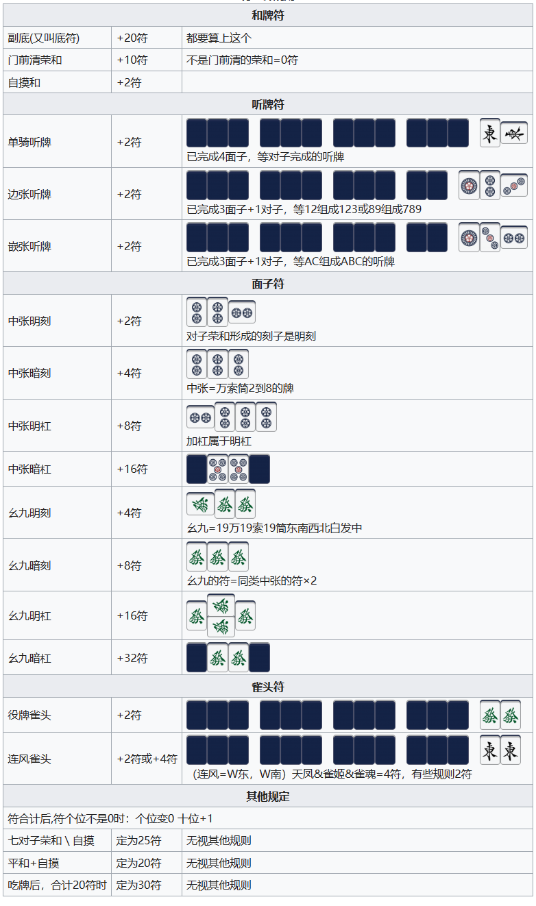

# 我要成为霓虹麻将高手！项目思路构建

## 大方向

1. 和牌型 
   - 振听 --> 状态为振听
   - 检查役种
      - 无役
        1. 计算面听
        2. 结算 -- 听牌不和
      - 计算
         1. 最高符数
         2. 点数
         3. 结算 -- 和了
2. 听牌型
   1. 计算面听
   2. 结算 -- 听牌不和
3. 未听
   1. 计算最小向听
   2. 结算 -- 未听

## 检验牌型阶段

1. 检验手牌区与副露区和牌型
   - 和牌型 $AgariChecker.c/h$
      - 若$status.currentPlayer$为$KAMICHA, TOIMEN, SHIMOCHA$，检验振听
         - 振听 --> **面听数计算**，$result->type = FURITEN$
         - 未振
            - 有役 --> **和牌计算**，$result->type = RON/TSUMO$
            - 未立直
               - 无役 --> **面听数计算**，$result->type = TENPAI$
      - **和牌计算**，$result->type = RON/TSUMO$
   - 听牌
      1. 振听 --> 振了：$result->type = FURITEN$，未振：$result->type = TENPAI$
      2. **面听数计算**
   - 未听牌 --> **向听数计算**，$result->type = NOTEN$

## 和牌计算

1. 计算役与番
   1. 将牌型与$BasicType.h$中牌型进行比较，得出役 $YakuChecker.c/h$
   2. 将役的番数、宝牌、里宝牌、红宝牌相加，得到最终番数
2. 计算最高符数 $Calculator.c/h$
3. 计算三家各自支付点数 $Calculator.c/h$
   1. 自家为亲家 $status.bakaze == status.jikaze$
   2. 自家为子家 $status.bakaze != status.jikaze$
   3. $TSUMO/RON$

## 面听数计算

*已解决*

## 向听数计算

*待补充*

## 役种判断

*已解决*

## 符数计算

## 现在进度

见git log